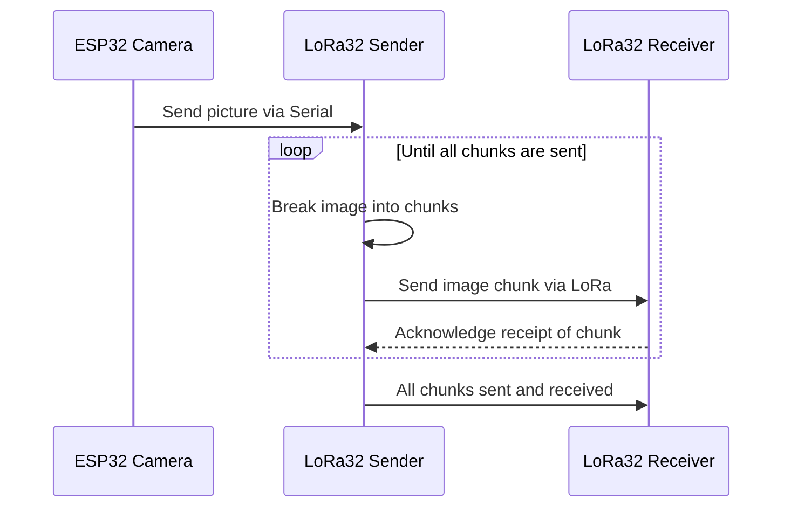

```mermaid
sequenceDiagram
    participant Camera as ESP32 Camera
    participant Sender as LoRa32 Sender
    participant Receiver as LoRa32 Receiver
    
    Camera->>Sender: Send picture via Serial
    loop Until all chunks are sent
        Sender->>Sender: Break image into chunks
        Sender->>Receiver: Send image chunk via LoRa
        Receiver-->>Sender: Acknowledge receipt of chunk
    end
    Sender->>Receiver: All chunks sent and received
```
